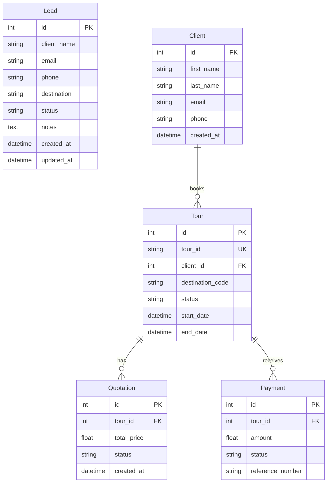

# Rang Travels CRM - Database Architecture

The CRM leverages a relational structure in PostgreSQL. Object relational mapping is structured via SQLAlchemy 2.0.

## Migration Scheme
All database mutations are handled sequentially through Alembic.
* Generate schema migrations:
  `alembic revision --autogenerate -m "Add new schema"`
* Run database updates:
  `alembic upgrade head`
